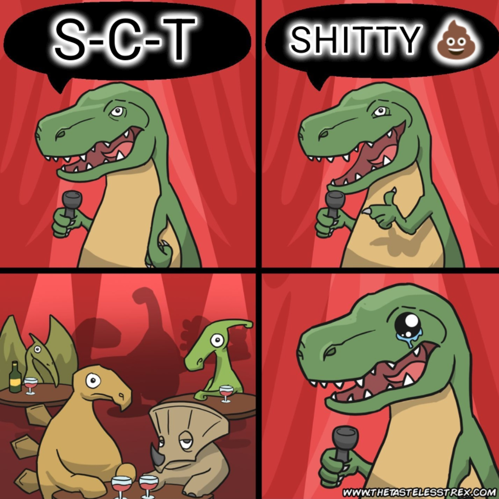

<p align="center">
  
    <h1 align="center">Simple Comic Translator 💩</h2>
    <p align="center">Translate comic and man<s>ga</s>/hwa/hua in batch.</p>
</p>

<p align="center">
<a href="https://github.com/Mayonnaisu/simple-comic-translator/blob/main/LICENSE">
  </a>
</p>

[](https://github.com/Mayonnaisu/simple-comic-translator/actions/workflows/test-app.yml)
[](https://github.com/Mayonnaisu/simple-comic-translator/actions/workflows/test-scripts.yml)

## STATUS
> [!WARNING]
> - Under construction 🛠️
> - Unstable ⚠️
> - Not thoroughly tested yet ⁉️

## DIRECTORY
*   [NOTICE](#notice)
*   [ABOUT](#about)
    *   [Full Name](#full-name)
    *   [Shorter Names](#shorter-names)
    *   [Background](#background)
*   [WORKFLOW](#workflow)
*   [DEMO](#demo)
*   [DOWNLOAD](#download)
    *   [Download Zip](#method-1-download-zip)
    *   [Clone Repo](#method-2-clone-repo)
*   [INSTALLATION](#installation)
    *   [Installer](#method-1-installer)
    *   [CLI](#method-2-cli)
*   [CONFIGURATION](#configuration)
    *   [Required](#required)
    *   [Optional](#optional)
*   [USAGE](#usage)
    *   [Launcher](#method-1-launcher)
    *   [CLI](#method-2-cli-1)
*   [UPDATE](#update)
    *   [Updater](#method-1-updater)
    *   [CLI](#method-2-cli-2)
*   [LIMITATIONS](#limitations)
*   [EXTRA INFO](extra-info)
    *   [How to Get Gemini API Key](#how-to-get-gemini-api-key)
    *   [FAQ](#faq)

## NOTICE
### <mark>All PowerShell scripts (.ps1) are only tested on Windows and may not be compatible with PowerShell Core run *directly* on other OSes.</mark>

## ABOUT
### Full Name
[***THAT TIME I GOT REINCARNATED AS A SCRIPT KIDDIE FOR THE SAKE OF CREATING THIS NOT-SO-SIMPLE COMIC TRANSLATOR WITH THE HELP OF MY UNRELIABLE SYSTEM (GEMINI)***](https://github.com/Mayonnaisu/simple-comic-translator) 😂

> *Me: "System, how to extract text from image with PaddleOCR?"<br>*
> *System: "To extract text from image with PaddleOCR- Oops, something went wrong with this response."*<br>
> *Me: "...."*<br>
> 
> *\*\*A few moments later\*\**
>
> *Me: "Alright, translate this OCR results to English."*<br>
> *System: ["503 UNAVAILABLE. {'error': {'code': 503, 'message': 'The model is overloaded. Please try again later.', 'status': 'UNAVAILABLE'}}"](https://github.com/google-gemini/gemini-cli/issues/4360)*<br>
> *Me: "WTF!"*

### Shorter Names
[***SCT***](#shorter-names)<br>
Read:<br>
-> "S-C-T"<br>
-> "ess-see-tee"<br>
-> "Shitty" 💩

<p align="center">
	
</p>

### Background
This is just a ~~shitty~~ simple app for translating comics in batch with Gemini. It can translate comic images in a folder recursively and save them to the corresponding output folder/subfolders with its [limitations](#limitations). Don't use this janky app! Instead, use these:

- [Manga Image Translator](https://github.com/zyddnys/manga-image-translator)
- [Manga Image Translator Rust](https://github.com/frederik-uni/manga-image-translator-rust)
- [Comic Translate](https://github.com/ogkalu2/comic-translate)
- [BallonsTranslator](https://github.com/dmMaze/BallonsTranslator)
- [EasyScanlate](https://github.com/Liiesl/EasyScanlate)

However, if you insist on using my app, then proceed to the next section. You've been warned! Just don't expect much cuz it's intended to be "simpler" than those better alternatives or other programs not mentioned here (go search them on your own).

## WORKFLOW
Go to [here](docs/workflow.md)

## DEMO
Go to [here](docs/demo.md)

## DOWNLOAD
### Method 1: Download Zip
1. Click on the green button on the top.
2. Select "Download ZIP".
3. Right click on the downloaded .zip file.
4. Select "Extract Here" with WinRAR or 7-Zip.

### Method 2: Clone Repo
**Prerequisites:**
- Git

```powershell
git clone "https://github.com/Mayonnaisu/simple-comic-translator"
```

## INSTALLATION
### Method 1: Installer
> **The installer only supports Windows 10 & 11.**
1. Open PowerShell as Administrator.
2. Change PowerShell execution policy by entering the command below:
```powershell
Set-ExecutionPolicy -ExecutionPolicy RemoteSigned -Scope LocalMachine
```
3. Enter y or yes.
4. Close the PowerShell.
5. Right click on **installer.ps1**.
6. Select "Run with PowerShell".
7. Select "Yes" if UAC prompt pops up.
8. Wait until you get ${{\color{lightgreen}{\textsf{INSTALLATION COMPLETED!}}}}\$ message.
> [!TIP]
> If you get a warning when opening the installer, uncheck the option, then Open. If you don't do this, the script won't be able to run properly.
	<details>
		<summary>View image</summary>
			<p align="center">
				
			</p>
	</details>

### Method 2: CLI
**Prerequisites:**
- Python 3.11.0
- Microsoft C++ Build Tools (for Windows)

```powershell
# Create virtual environment
python -m venv venv

# Activate it
## For Windows
venv/Scripts/activate
## For Linux
source venv/bin/activate

# Install dependencies
pip install -r requirements-lock.txt
```

## CONFIGURATION
### Required
> [!NOTE]
> Create **.env** file manually if you didn't use the installer.
> ```powershell
> # .env
> GEMINI_API_KEY=''
> ```

1. Open **.env** file with text/code editor (Notepad, VS Code, etc).
2. Paste your [Gemini API key](#how-to-get-gemini-api-key) between the quotation marks.
3. Save.

### Optional
1. Open **config.json** with text/code editor.
2. Change the settings as you see fit.
3. Save.

For more info, see [config options](docs/config.md).

## USAGE
### Method 1: Launcher
1. Right click on **launcher.ps1**.
2. Select "Run with PowerShell".
3. Select a folder containing your manga/hwa/hua.

### Method 2: CLI
```powershell
# Activate venv
## For Windows
venv/Scripts/activate
## For Linux
source venv/bin/activate

# Run with required argument only
python main.py --input "YOUR/COMIC/FOLDER/PATH"

# For more info
python main.py --help
```

## UPDATE
### Method 1: Updater
> [!WARNING]
> This updater will replace the old files with the newer ones, so make sure to back up the files you want to keep first. For more info, see [here](CHANGELOG.md).

1. Right click on **updater.ps1** > Run with PowerShell.
2. Wait until you get ${{\color{lightgreen}{\textsf{UPDATE COMPLETED!}}}}\$ message.

### Method 2: CLI
**Prerequisites:**
- Git

```powershell
# Update local repo
git pull

# Install new dependencies
pip install -r requirements-lock.txt
```

## LIMITATIONS
1. Currently, it can't properly recognize vertical texts, which is usually found in manga.
2. Some sound effects (onomatopoeia) and watermark texts are also detected and recognized, making the result riddled with unnecessary texts and white rectangles.
3. No automatic retry in case of error.
4. It can't automatically detect the input language and only supports one language in each process. As a result, you need to manually specify the language in **config.json**.

## EXTRA INFO
### How to Get Gemini API Key
1. Visit https://aistudio.google.com/app/apikey.
2. Accept the Terms and Conditions.
3. Click "Create API key".
4. Name your key.
5. Choose project > Create project.
6. Select the newly created project.
7. Click "Create key".
8. Click the code in the "Key" column.
9. Click "Copy key".
> [!TIP]
> Gemini API Free Tier has rate limits, see: https://ai.google.dev/gemini-api/docs/rate-limits#current-rate-limits.
>
> **To check your quota:**
> 1. Visit https://aistudio.google.com/app/usage
> 2. Make sure you are on the right account & project.
> 2. Click "Open in Cloud Console" on the bottom.
> 3. Scroll down > Click "Quotas & System Limits".
> 4. Scroll down > You will see your model quota usage on the top result. If you don't see it, use Filter to search it.
>
> For example: 
	<details>
		<summary>View image</summary>
			<p align="center">
				
			</p>
	</details>

### FAQ
1. **How to change detector, ocr, translator, etc, you ask?**<br>
    You can't, unless you modify the source code yourself. Or just use the aforementioned alternatives. You can change [Gemini model](https://docs.cloud.google.com/vertex-ai/generative-ai/docs/learn/model-versions#gemini-auto-updated) in **config.json** tho.
