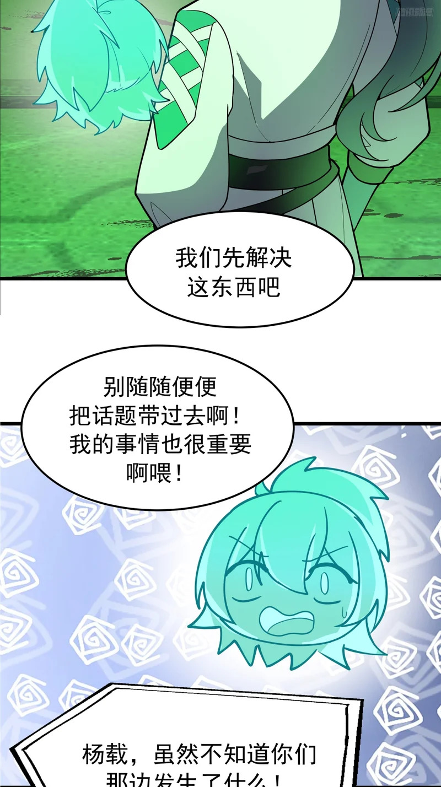
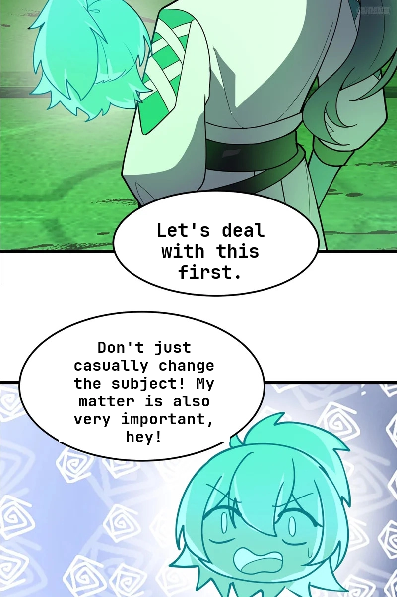
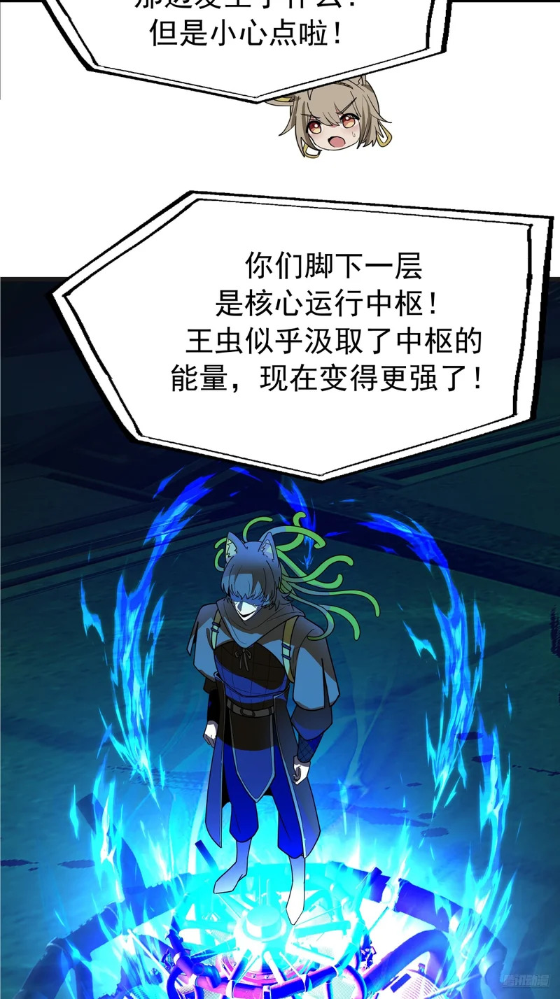
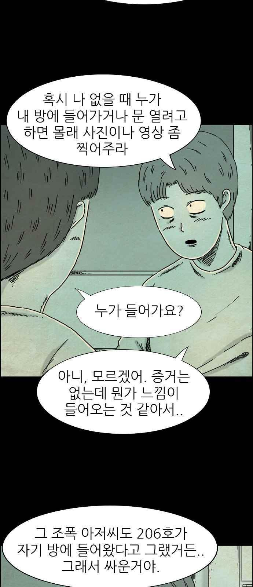
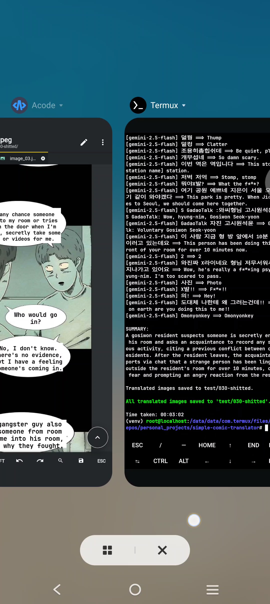

## DEMO

> [!NOTE]
>
> Tested on:
> - [Windows 11 25H2](#windows-11-25h2)
> - [Ubuntu 25.10 (proot-distro) in Termux](#ubuntu-2510-proot-distro-in-termux)

### Windows 11 25H2
#### Configuration
```jsonc
// enable image merging
  "IMAGE_MERGE": {
    "enable": true
  }
```
```jsonc
// disable PaddleOCR's slicer
  "OCR": {
    "merge_y_threshold": 30,
    "merge_x_threshold": 100,
    "slicer": {
      "enable": false,
      "horizontal_stride": "original",
      "vertical_stride": 640
    }
  }
```

#### Result
<table align="center" width="600">
    <tbody>
        <tr>
            <h5 align="center">Manhua (Martial Peak)</h5>
        </tr>
        <tr>
            <td width="300">
                <h5 align="center">Original</h5>
            </td>
            <td width="300">
                <h5 align="center">Shitted</h5>
            </td>
        </tr>
        <tr>
            <td width="300">
                
            </td>
            <td width="300">
                
            </td>
        </tr>
        <tr>
            <td width="300">
                <table align="center">
                    <tr align="center">
                        <td>
                            
                        </td>
                    </tr>
                </table>
            </td>
            <td width="300">
                <table align="center">
                    <tr align="center">
                        <td>
                            
                        </td>
                    </tr>
                    <tr align="center">
                        <td>
                            
                        </td>
                    </tr>
                </table>
            </td>
        </tr>
    </tbody>
</table>

Lol, the name is wrong, which is quite usual for machine translation. Then again, I only translated 1 chapter for demo purpose.

### Ubuntu 25.10 (proot-distro) in Termux
#### Post-installation
```bash
# Replace opencv with opencv-headless
pip uninstall opencv-python opencv-contrib-python opencv-python-headless -y

pip install numpy==1.26.4 opencv-python-headless opencv-contrib-python-headless
```

#### Configuration
```jsonc
// disable image merging
  "IMAGE_MERGE": {
    "enable": false
  }
```
```jsonc
// disable PaddleOCR's slicer
  "OCR": {
    "merge_y_threshold": 30,
    "merge_x_threshold": 100,
    "slicer": {
      "enable": false,
      "horizontal_stride": "original",
      "vertical_stride": 640
    }
  }
```

#### Result
<table align="center" width="600">
    <tbody>
        <tr>
            <h5 align="center">Manhwa (Hell is Other People)</h5>
        </tr>
        <tr>
            <td width="300">
                <h5 align="center">Original</h5>
            </td>
            <td width="300">
                <h5 align="center">Shitted</h5>
            </td>
        </tr>
        <tr>
            <td width="300">
                
            </td>
            <td width="300">
                
            </td>
        </tr>
    </tbody>
</table>

My phone sure is slow haha. Well, the program was run inside a container within an emulator after all. The overhead is to be expected.